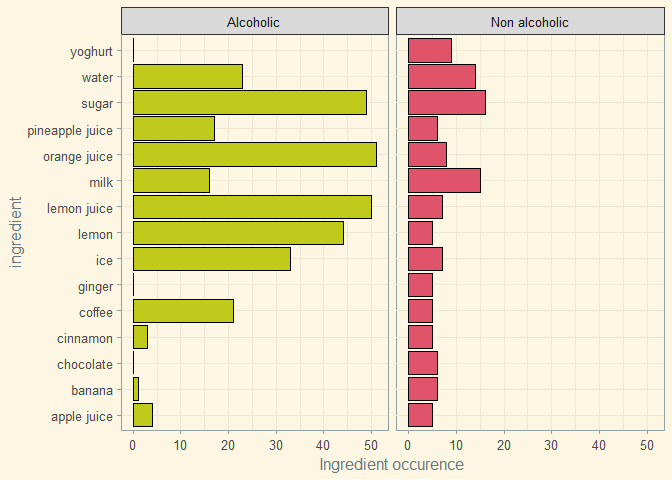
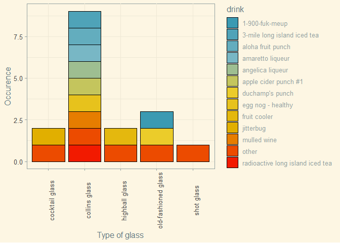
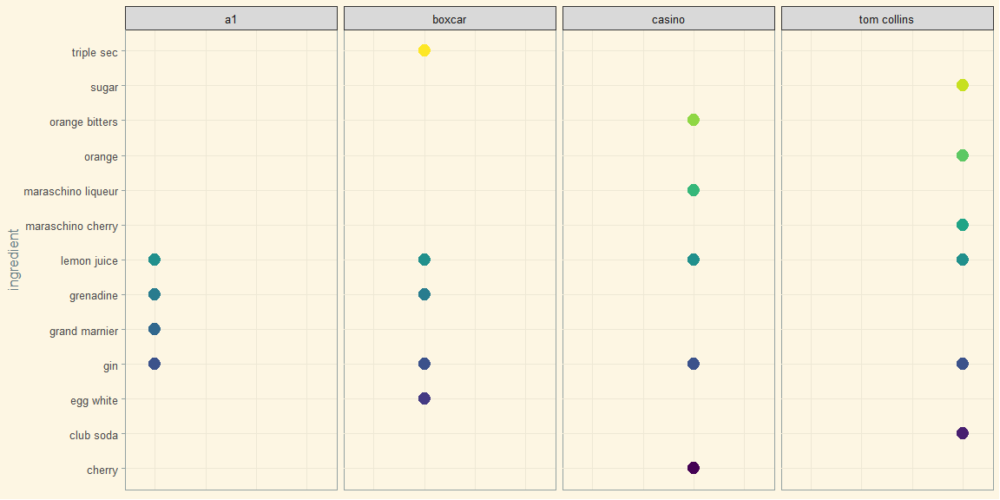

Cocktails
================

As someone who had abstained from alcohol for the majority of their life
span, I am quite clueless when it comes to good drink combinations.

Thus, exploring a couple of cocktail data sets AND filling out the gaps
in my experience that formed from me not getting blackout drunk in my
teenage years seemed like a fine idea.

The data comes from the [Tidy
Tuesday](https://github.com/rfordatascience/tidytuesday/blob/master/data/2020/2020-05-26/readme.md)
community, which in turn took it from Kaggle.

# The distribution of alcoholic vs non-alcoholic drinks

The results are not surprising - most of the cocktails are alcoholic.

<!-- -->

# Top 25 ingredients

I took the top 25 most common ingredients and graphed them in a circular
manner - this was inspired by @JacobHakim2 over at Twitter.

<!-- -->

# Ingredients in alcoholic vs non-alcoholic drinks

I took the most common ingredients in non alcoholic drinks and then
compared their occurrence in both categories.

I wanted to try out a new package for graphs - ggcharts. However…

<!-- -->

The pyramid\_chart() function was not working properly despite my
salvaging attempts - the columns only match the proper ingredient names
on the right hand side of the chart.

Thus, I ended up resorting to the classic ggplot() + facet\_wrap()
option for this visualization:

<!-- -->

Also, thank God no one uses yoghurt in alcoholic drinks.

# Types of drink categories:

“Ordinary Drink” appears to be the most common category in this dataset.

<!-- -->

# The most common ingredients in ordinary drinks:

Gin is the clear winner here, followed by vodka and lemon juice.

Here the ggcharts package worked nicely, without presenting any issues.

<!-- -->

# Which category uses the most ingredients on average?

## A table:

| Category             | Average ingredient count |
| :------------------- | -----------------------: |
| Homemade Liqueur     |                 4.056338 |
| Punch / Party Drink  |                 3.417112 |
| Milk / Float / Shake |                 3.053333 |
| Cocoa                |                 2.926829 |
| Cocktail             |                 2.684426 |
| Ordinary Drink       |                 2.660377 |
| Other/Unknown        |                 2.508065 |
| Soft Drink / Soda    |                 2.459459 |
| Coffee / Tea         |                 2.395062 |
| Shot                 |                 2.230263 |
| Beer                 |                 1.812500 |

Looks like it is homemade liqueur.

## A graph:

## Ingredients in homemade liqueur:

I wouldn’t have expected to see coffee here\!

<!-- -->

# What are the top 5 most commonly recommended glass types?

If you want to have the most luck at having picked the correct glass -
go simple and use a cocktail glass.

| glass               | sum |
| :------------------ | --: |
| cocktail glass      | 449 |
| collins glass       | 413 |
| highball glass      | 377 |
| old-fashioned glass | 229 |
| shot glass          | 104 |

# Glass types and drinks:

I:

1)  selected the top 5 glass types,

2)  retrieved the top 10 most popular drink types for said glasses,

3)  mutated the drink variable to only contain 11 levels: either one of
    these top drinks, or “other”

4)  grouped by glass and drink type and sorted by occurence in a
    descending order, then took the top 20 results and

5)  plotted everything in a bar chart

<!-- -->

# Which ingredients are the most commonly used with gin?

The top 3 would be lemon juice, grenadine and dry vermouth.

<!-- -->

# Which drinks have the longest names?

There are certainly some intriguing specimens here.

| Drink name                            | Length | Drink Id |
| :------------------------------------ | -----: | -------: |
| banana strawberry shake daiquiri-type |     37 |    12658 |
| ’57 chevy with a white license plate  |     36 |    14029 |
| radioactive long island iced tea      |     32 |    16984 |
| grape lemon pineapple smoothie        |     30 |    12712 |
| brandon and will’s coke float         |     29 |    16447 |
| lassi - a south indian drink          |     28 |    12690 |
| orange scented hot chocolate          |     28 |    12748 |
| owen’s grandmother’s revenge          |     28 |    13200 |
| pineapple gingerale smoothie          |     28 |    12718 |
| 3-mile long island iced tea           |     27 |    15300 |

# Let’s plot some of the more interesting cases:

Not as complicated as the names make them sound, huh?

I was surprised at the combination of vanilla ice-cream and coke, but a
source tells me this was common among kids even here in Lithuania\!

<!-- -->

# A random sample of drinks containing both gin and lemon juice:

<!-- -->

# Boston cocktails

Let’s have a short glance at this dataset. What are the top ingredients
and how often do they occur in all categories but the Cocktail Classics?

<!-- -->

# An apology to the Cocktail Classics for having excluded them:

Everybody likes classics, right?

<!-- -->

# A random sample of drinks:

The boston cocktail data set provides a measure for each ingredient,
which is handy for anyone wanting to test the drink recipes.

<!-- -->

# Alcoholic drinks containing milk:

This one is for a friend.

<!-- -->
